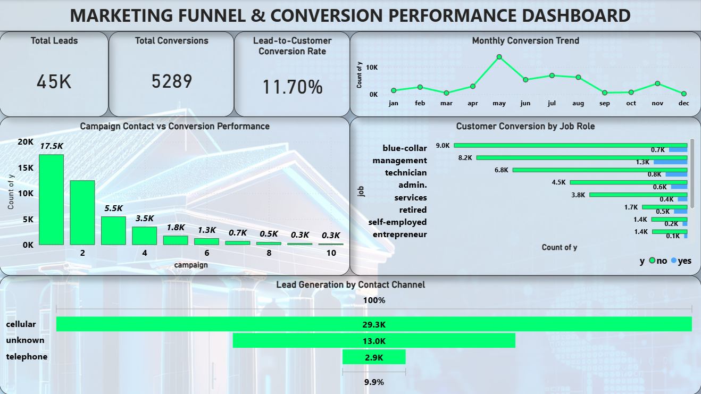

# Marketing Funnel & Conversion Performance Dashboard

Power BI Project | Future Interns – Data Science & Analytics Internship

This Power BI project analyzes marketing funnel data to understand lead generation and customer conversion patterns.

## Dashboard Preview

## Dashboard Features

- Total Leads Generated
- Converted Customers
- Overall Conversion Rate
- Monthly Customer Conversion Trend
- Campaign Contact vs Conversion Performance
- Customer Conversion by Job Segment
- Lead Distribution by Contact Channel

## Tools Used

- Power BI
- Data Visualization
- Marketing Analytics

# Dataset Source

Dataset Source: UCI Bank Marketing Dataset (bank-full.csv)

This dataset contains marketing campaign data from a Portuguese banking institution and is commonly used for customer conversion and marketing analytics.
